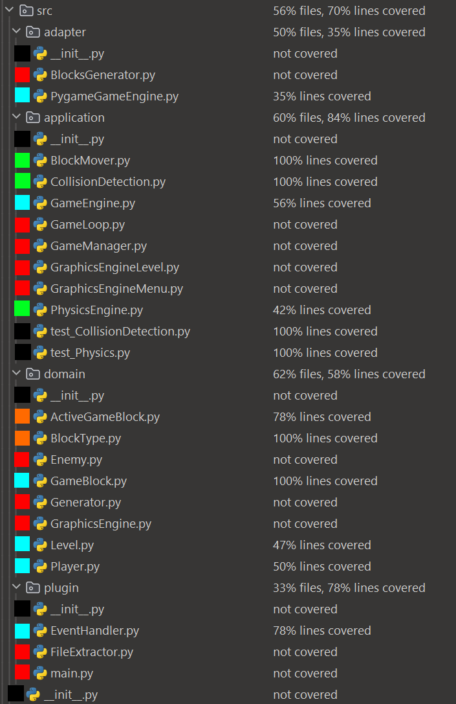

# Advanced Software Engineering

Florian Babel, Daniel Schomburg

## Übersicht

Für den Programmentwurf haben wir ein Spiel mit Python entwickelt. Dafür wurden die Python Bibliothek
_Pygame_ benutzt, um einige Funktionen zur Ein- und Ausgabe und der Interaktion zwischen Objekten zu vereinfachen.

## Clean Architecture

### Schichten

Wir haben die Schichten Domain, Application, Adapter und Plugin umgesetzt. Alle Abhängigkeiten verlaufen von außen nach innen.

#### Domain

In der Domain sind alle Klassen enthalten, die das Spiel selbst ausmachen, da elementare Bestandteile implementiert werden. In der Domain findet sich zunächst das Level, das während des Spiels die Blöcke verwaltet und bei der Initialisierung verschiedenen Events zuordnet. Des weiteren befinden sich dort die GameBlocks sowie die daraus abgeleiteten Klassen. Als letztes sind hier zwei Interfaces zu finden, die in der Application implementiert werden.

#### Application

In der Application sind alle Klassen enthalten, die den Ablauf eines Spiels regeln und Interaktionen zwischen verschiedenen Objekten regeln. Zunächst der GameManager, der den Übergang zwischen den Levels und das Menu verwaltet. Als nächstes der GameLoop, der dauerhaft läuft und den User Input empfängt und fürs Spiel relevante Events auslöst. Das Interface der GameEngine befindet sich hier und wird im Plugin implementiert. Die restlichen Klassen sind jeweils für die Berechnung der Physik und die Grafikausgabe zuständig.

#### Adapter

Der Adapter enthält Klassen, die ein Datenmodel oder ein bestimmtes Funktionsset in ein anderes übersetzt. Der BlocksGenerator wandelt ein Array aus Bildpunkten in ein Array aus GameBlocks um, die im Spiel genutzt werden. PygameGameEngine ist der einzige Kontaktpunkt zu Pygame. Es implementiert das gameEngine Interface aus der Application. Hier werden die benötigten Funktionen von Pygame abstrahiert, sodass diese ohne Abhängigkeit überall genutzt werden können, indem auf das Interface zugegriffen wird.

#### Plugin

Im Plugin sind Klassen definiert, die leicht austauschbar sein sollen. So ist es sehr einfach einen anderen EventHandler oder einen anderen extractor hinzuzufügen. Dabei haben wir darauf geachtet, dass die Abhängigkeiten immer vom Core zur Application zu Plugin eingehalten werden, um dem Model zu entsprechen.

## Entwurfsmuster

Wir haben als Entwurfsmuster den Observer umgesetzt. Dafür wurde ein Event Handler implementiert. Dieser ermöglicht die Interaktion zwischen mehreren Klassen und dynamisches Verhalten auf Events. Die Klasse _EventHandler_ hat als innere Klasse _Events_. Für die Verwaltung der Events gibt es die Methoden _add_ und _remove_. Beim Hinzufügen eines Events, wird die übergebenen Methode in der entsprechenden Eventliste gespeichert. Um ein Event auszulösen wird die Instanz des Eventhandlers mit dem Event und eventuelle Parameter aufgerufen. Dann werden alle Funktionen in der Eventliste ausgeführt und die Parameter weitergeleitet. Dies entspricht dem klassichen Beobachter Entwurfsmuster.

## Programming Principles

### SOLID

#### S - Single Responsibility

Rund um die Physik Berechnung erfüllen die Klassen das Single Responsibility Prinzip, indem jede Methode mit einer eigenen Aufgabe in eine eigene Klasse ausgelagert ist. Zunächst wird der
_PhysicsEngine_ die Geschwindigkeit der Blöcke ausgerechnet. An dieser Stelle gibt es noch zwei Methoden, da die Berechnung der Geschwindigkeit des
_Player_ Tastatureingaben berücksichtigen muss. Die Berechnung des
_Enemies_ braucht aber eine eigene Methode, da sich dieser auch ohne Eingaben Bewegen muss. Während dieser Berechnung wird abgefragt, ob der entsprechende Block Kollisionen mit anderen Blöcken hat und sich somit nicht weiter in diese Richtung bewegen kann. Die Kollisionserkennung ist in einer eigenen Klasse implementiert und wird von beiden Methoden genutzt. Die Aufgabe ist nur aus einem Subjekt und einer Liste aus Blöcken alle Kollisionen zurückzugeben. Sobald die Geschwindigkeit berechnet wurde müssen die Blöcke bewegt werden. Da beim Bewegen noch Kollisionen auftreten können, braucht es eine extra Methode, die die Blöcke um ihre Geschwindigkeit bewegen, aber im Falle einer Kollision dahin den Block nicht weiter bewegen.

#### O - Open/Closed

Die Arten von Blöcken sind leicht erweiterbar, ohne bestehende Blockarten zu ändern. Dafür gibt es zunächst ein Enum, in dem alle Block Arten von Blöcken definiert werden. Wird eine neue Art von Block implementiert, muss in das Enum ein neuer Eintrag erfolgen. Während der Generation der Karte in
_BlocksGenerator_ müssen dem Block die Basis Eigenschaften zugeordnet werden, indem ein weiteres if hinzugefügt wird. Falls der Block nur passive Eigenschaften hat reicht es in den aktiven Blöcken die Reaktionen auf einen solchen Block zu implementieren. Falls der Block eigene Funktion haben soll, kann die Vererbungskette von
_GameBlock_ an einer beliebigen Stelle genutzt werden, um dem neuen Block aktiv zu machen. An dieser Stelle kann der Block Events empfangen und darauf reagieren. Falls neue Events gebraucht werden, kann auch dort einfach eine neue Eventart hinzugefügt werden und an der benötigten Stelle genutzt werden.

#### L - Liskov Substitution

Die Klassen _GameBlock_ und _ActiveGameBlock_ erfüllen das Liskov Substitution Prinzip. _GameBlock_ ist die
Elternklasse, von der _ActiveGameBLock_ erbt. In dieser Vererbung werden zusätzliche Funktionalität hinzugefügt, wie
dass der _ActiveGameBlock_ ein Funktion zum Verändern der Position hat. An keiner Stelle wird die Funktionalität
eingeschränkt, sodass an jeder Stelle an der _GameBlock_ genutzt wird, auch der _ActiveGameBLock_ genutzt werden kann.
So kann _BlocksGenerator_ in Zeile 44 der _GameBLock_ durch _ActiveGameBLock_ ersetzt werden und das Programm läuft ohne
Probleme. Der einzige Unterschied ist, dass alle sonst statischen Blöcke eine Funktion zum Bewegen haben, die aber nie
aufgerufen wird.

#### I - Interface Segregation

Die _Engine_, die als Adapter zwischen Pygame und dem restlichen Programm steht, wurde im
Commit `d2cd48a6449e6e9502609b903fccfb5135dfe208` in zwei Teile geteilt. Dadurch wurde das Interface in die zwei Teile
für Graphics und Game segregiert. Falls jetzt eine andere Engine verwendet werden soll, diese aber nur die Grphics
abdecken soll, ist das deutlich einfacher, da ein Interface von einer anderen Interface implementiert werden muss, aber
die implementierung des Game Interface bleibt unverändert bestehen.

#### D - Dependency Inversion

An vielen verschiedenen Stellen wird die Dependency Inversion genutzt. Als Beispiel soll hier die Game Engine dienen.
Zunächst existiert das
_GameEngine_ Interface. Die Funktionen werden von _PygameGameEngine_ implementiert. In der _main_ wird eine
_PygameGameEngine_ definiert und an den _GameLoop_ und
_GameManager_ übergeben. Dort kann diese Klasse wie eine GameEngine genutzt werden. In Python ist es nicht nötig die Art
der Klasse anzugeben, sodass die GameEngine hier auch weggelassen hätte können. Da die GameEngine, aber die Methoden
definiert und die
_PygameGameEngine_ alle Methoden implementieren muss, wird erzwungen, dass eine abgeleitete Klasse alle Funktionalitäten
übernimmt.

### GRASP

Daniel

#### High Cohesion

Level, Attribute hängen zusammen

#### Low Cuppling

Event handler, player kann enemyy/block kill/remove

### DRY

Die am häufigsten von verschiedenen Stellen aufgerufene Klasse ist _CollisisonDetection_. An drei verschiedenen Stellen
wird sie benutzt und trägt so zu Don't repeat yourself bei. An jeder der Stellen, hätte die Funktionalität separat
implementiert werden können, da die FUnktion aber immer die gleiche ist, hat es von Anfang an Sinn ergeben diese
auszulagern.

## Tests

In der Application wurden 13 Unit-Tests für zwei Klassen umgesetzt. Für die CollisionDetection sind 8 Tests vorhanden, um Kollisionen in alle vier Richtungen zu testen. Dafür gibt es für jede Richtung zwei Tests, da die Detection mit und ohne border ausgeführt werden kann. Da das gewünschte Verhalten nicht Intuitiv zu programmieren ist, ist ein Test hier besonders wichtig, um das korrekte Verhalten sicherzustellen. An dieser Stelle hat der Test auch einmal einen Fehler erkannt. Während der Implementation der GameEngine, wurden Variablen durch einen Tippfehler falsch übergeben. Dadurch entstand ein Fehler, der beim Spielen nicht sofort offensichtlich war. Der Test hat aber angeschlagen, sodass der Fehler schnell gefunden und beseitigt werden konnte. Um die PhysicsEngine zu testen gibt es 5 Tests. Diese testen zunächst nur die Bewegung des Spielers. Dabei wird in einem Testfall auch überprüft, dass dieser nicht in eine Wand reinlaufen kann, auch wenn die Geschwindigkeit dies ermöglichen würde. Weitere Tests setzen eine Methode vorher an und testen ob die berechnung der Geschwindigkeit korrekt verläuft, indem der freie Fall auf den Boden und ein Sprung gegen die Decke getestet wird. An dieser Stelle könnten noch sehr viel mehr Testfälle implementiert werden, um verschiedene Bewegungsmuster, die andere Auswirkungen haben zu überprüfen.

### AAA

Die AAA Normalform wurde umgesetzt, indem in jedem Test klar zwischen Arrange, Act und Assert unterschieden wurde. So
wird in allen Test in
_test_CollisionDetection_ zunächst ein
_CollisionDetection_ Objekt durch eine andere Methode erstellt. Als nächstes werden die Blocke, die interagieren
erstellt. Die detection wird mit den Blöcken aufgerufen. Die in Variablen gespeicherten Werte, werden durch asserts
überprüft. In
_test_Physics_ kann das nicht komplett umgesetzt werden, da in zwei Tests ein Bewegungsablauf getestet wird. Dabei wird
eine Funktion ausgeführt, die Auswirkung getestet und das wiederholt. Eine Aufteilung in mehrere Test wäre hier
umständlich, da nur ein Sachverhalt getestet wird.

### ATRIP

#### Automatic

Alle Tests lassen sich durch einen Klick ausführen lassen und erfordern kein Eingreifen. In Pycharm ist eingestellt, dass bei einem Commit automatisch alle Tests ausgeführt werden.

#### Thorough

Die Physik der Blöcke ist nicht intuitiv implementiert, da die Domain nicht intuitiv ist. Dementsprechend fielen dort viele Fehler an, sodass dieser Bereich ausführlich getestet ist.

#### Repeatable

Es sind keine Fälle von fehlerhaften Tests bekannt. Solange es keine Tests der Tests gibt, die Bewiesen korrekt sind, lässt sich diese Aussage nicht untermauern. Es wird nicht absichtlich auf Werte Zugegriffen, die von einer variablen Umgebung abhängig sind.

#### Independent

Alle Tests sind insofern unabhängig, dass sie komplett unabhängig laufen können und keine Werte aus anderen tests
übernehmen. An allen Stellen an denen es möglich ist, wird nur genau ein Fehlerfall geprüft. An einigen Stellen ist dies
nicht möglich. In
_test_Physics_ wird die Reaktion des Players auf Benutzereingaben getestet. Da zunächst die Geschwindigkeit ausgerechnet
wird und anschließend der Player bewegt wird, lässt sich im Fehlerfall noch nicht eindeutig feststellen, ob die
Geschwindigkeitsrechnung und Bewegung einen Fehler hat. Das lässt sich auch nicht aufspalten, da die Geschwindigkeit
nirgends gespeichert oder zurückgegeben wird, sondern direkt weitergegeben wird. Ein Tests kann also erst nach der
Bewegungsfunktion die Auswirkungen prüfen. Ein Umbau der Funktionen, um diese besser testen zu können, wäre möglich,
würde aber eine komplette Konzeptänderung erfordern. Da das Konzept an sich sinnvoll ist, haben wir entschieden diese
Anpassung nicht zu übernehmen. In Zusammenspiel mit anderen Tests wird der Fehlerfall eingegrenzt da einer der beiden
Fehlerfälle in anderen Tests überprüft wird. So lässt sich die Fehlerquelle eingrenzen.

#### Professional

Alle Tests und Variablen sind verständlich benannt, sodass sich sofort die Funktion ableiten lässt.

### Code Coverage

Auf der untenstehenden Abbildung ist das Ergebnis der Code Coverage zu sehen. Die Darstellung von Pycharm ist dabei
nicht ganz sinnvoll, da Dateien, wie init.py und die Tests selbst, mit in der Code Coverage auftauchen. Dabei ist es
offensichtlich, dass diese Dateien 100% bzw. 0% Abdeckung haben. Diese Dateien wurden mit schwarz gekennzeichnet. Die
Roten Dateien wurden nicht getestet und wurden dementsprechend auch nicht aufgerufen. Das sind die Klassen, die das
Spiel verwalten, die Grafik ausgeben und die Karten generieren. Alle anderen Dateien wurden aufgerufen, wobei auffällt,
dass deutlich mehr Dateien abgedeckt sind, als aktiv getestet wurden. Die Grünen sind die Klassen denen die Testfälle
zuzuordnen sind. Die Türkisen wurden dafür auch in den Tests selbst benutzt, da sie für die Funktionalität nötig sind.
Die Orangen wurden nicht direkt aufgerufen, sind aber trotzdem abgedeckt, da es Interfaces von benutzten Klassen sind.

Die Abbildung ist bei dem Testdurchlauf der Tests in Application entstanden. Der Test TestBlocksGenerator ist nicht
enthalten.

### Mocks

Für den Test _TestBlocksGenerator_ wurde ein Mock erstellt, um den _BlockGenerator_ zu testen, ohne dass eine Quelldatei
benötigt wird. Die getestete Klasse bekommt vom _FileExtractor_ ein Array mit Farbwerten, aus denen Blöcke generiert
werden. Abhängig von der Farbe wird ein anderer Block an der Position generiert. Diese Funktionalität wird getestet. Der
_FileExtractor_ erhält normalerweise einen Dateipfad, über den eine .bmp Datei eingelesen wird und in ein Array
umgewandelt wird. Um nicht davon abhängig zu sein, gibt das Mock ein statisches Array zurück, in dem bestimmte Blöcken,
an der Stelle noch Farben, definiert sind. Der Übergabeparameter _path_ wird dabei ignoriert.

## Refactoring

b7b7e9b1163c26da2d2a4e2e077fa5e530495103 dead code in enemy

d100b13c25f82f2faadad4dccf1f289b71aa414b refactoring dict in in generator

b691ef63e0b76895d4d2caca4f9f445402e3f875 klasse zu groß